# KPI plot

## Dependencies
|Librairies | version|
|-----------|--------|
|parameters_project.py (local)| - |
|KPI.py (local)| - |
|pandas| 2.2.1 |
|plotly.graph_objects| 5.20.0 |
|plotly.subplots| 5.20.0 |

## Summary
Class create plots from KPIs.py. Use the KPI.py library to generate the data. 
Normal size of an image 1200x800 px.<br/>
**class_name** : plot_KPI

## Methods
### __init__(self, database, project, year) -> None
Initialize the import_data class.

**Parameters:**

- `self` (self):
    General information

- `database` (df):
    Database used for calculation of the KPIs

- `project` (str):
    The project name.

- `year` (str):
    The year of the project.

**Returns:**

- `None` (None):
    No return value.

**Example:**
```python
# Create an instance of the class
obj = plot_KPI(database=database, project="HYHA", year="2024")

# Access the attributes
print("project:", obj.project)
print("year:", obj.year)
print("year_short:", obj.year_short)
```

### analyze_load_plot(self)

Module for plot the load curve for a certain project in a certain period.

**Parameter:**

- `self` (self): General information

**Return:**

- `fig_analyze_load` (go.Figure): Figure containing the plot of the load curve

**Example:**

```python
plot_KPI(database, 'HYHA', '2024').analyze_load_plot().show()
# return :
```
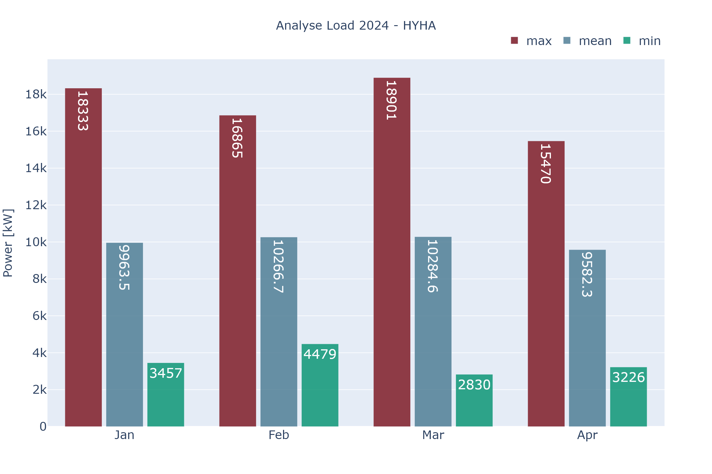

### aux_plot(self)
 
Module for plot the auxiliaries consumption graph for a certain project in a certain period.

**Parameter:**

- `self` (self): General information

**Return:**

- `fig_aux_cons` (go.Figure): Figure contain plot of the auxiliaries consumption

**Example:**

```python
plot_KPI(database, 'HYHA', '2024').aux_plot().show()
# return :
```
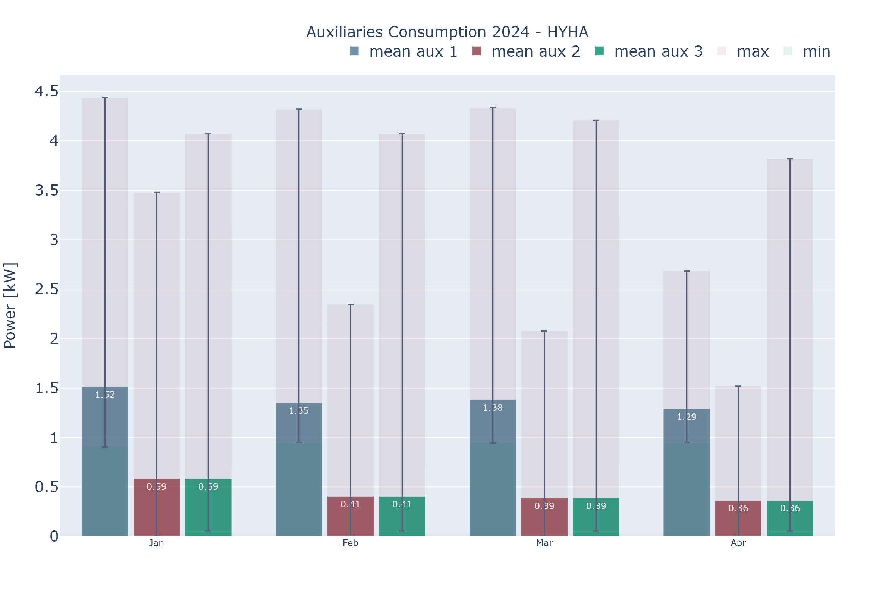


### aux_content(self)
 
Module for table the auxiliaries content for a certain project.

**Parameter:**

- `self` (self): General information

**Return:**

- `fig_aux_content` (go.Figure): Figure contain content on each aux_N

**Example:**

```python
plot_KPI(database, 'HYHA', '2024').fig_aux_content().show()
# return :
```
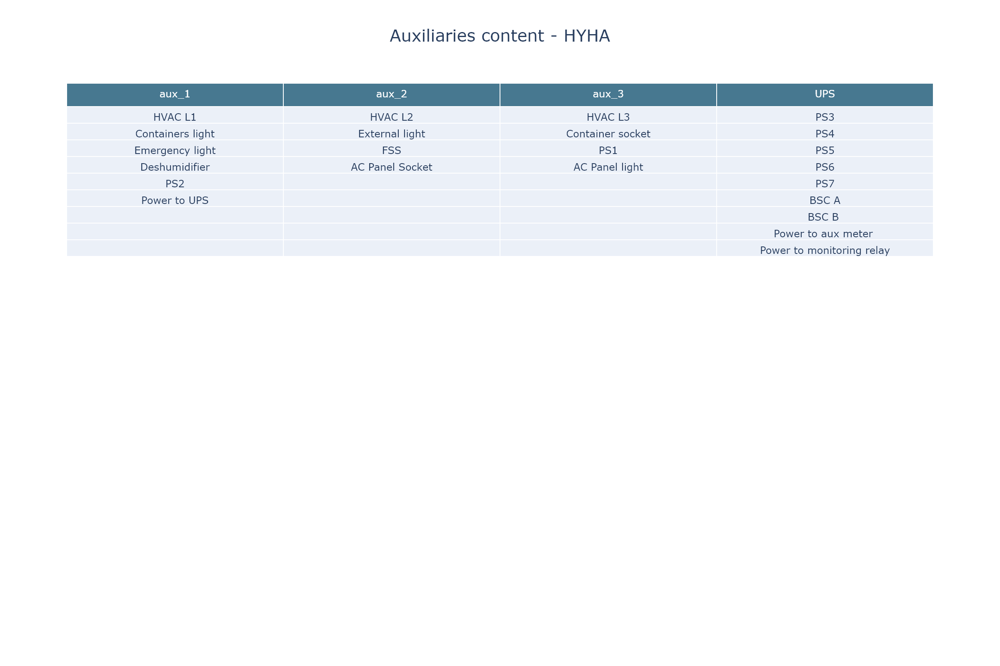

### aux_energy(self)
 
Module for plot energy from the auxiliaries for a certain project.

**Parameter:**

- `self` (self): General information

**Return:**

- `fig_ener_aux` (go.Figure): Figure contain bar of energy per month

**Example:**

```python
plot_KPI(database, 'HYHA', '2024').aux_energy().show()
# return :
```


### peak_miss_table(self)
 
Module for plot the table of missed peak for a certain project in a certain period.

**Parameter:**

- `self` (self): General information

**Return:**

- `fig_peak_miss` (go.Figure): Figure contain table of the peak missed. 
            Normally empty.

**Example:**

```python
plot_KPI(database, 'HYHA', '2024').peak_miss_table().show()
# return :
```
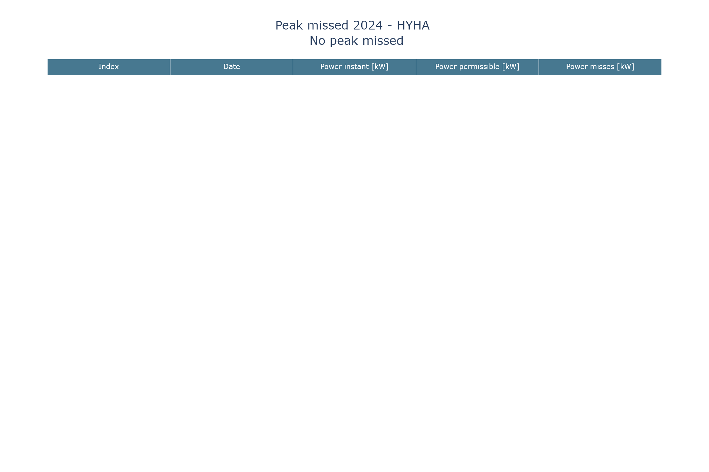

### soc_plot(self)
 
Module for plot the graph of average and cumulative SoC for a certain project in a certain period.

**Parameter:**

- `self` (self): General information

**Return:**

- `fig_soc` (go.Figure): Figure contain graph of the SOC

**Example:**

```python
plot_KPI(database, 'HYHA', '2024').soc_plot().show()
# return :
```
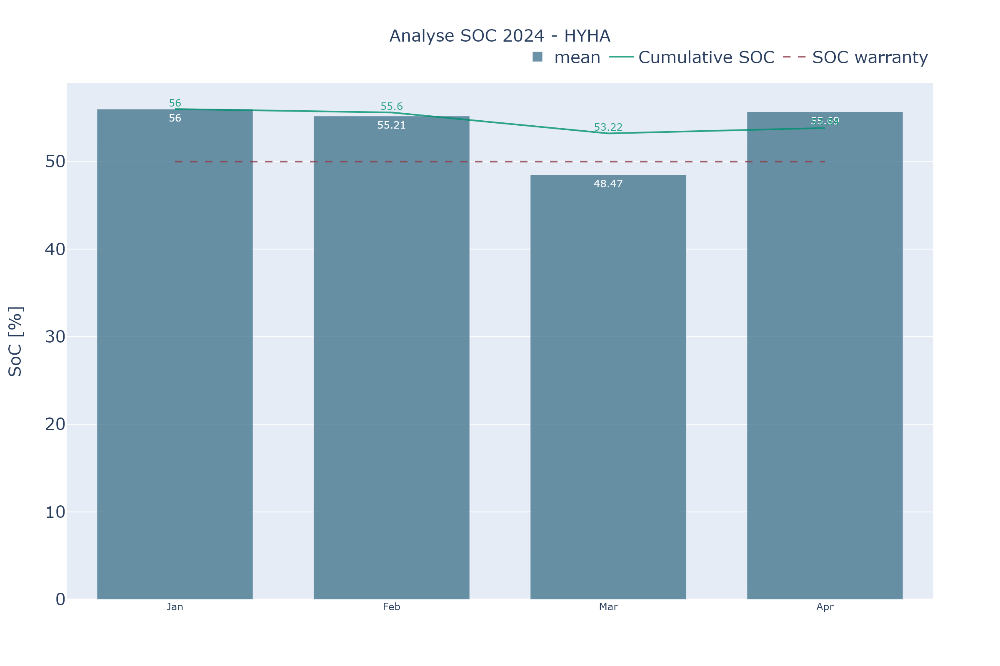

### soc_sorted_plot(self)
 
Module for plot the graph of average, min and max SoC for a certain project for each HLZ period in a month.

**Parameter:**

- `self` (self): General information

**Return:**

- `fig_soc_sorted` (go.Figure): Figure contain graph of the SOC sorted by type HLZ ('on peak', 'off peak', 'FCR')

**Example:**

```python
plot_KPI(database, 'HYHA', '2024').soc_sorted_plot().show()
# return :
```
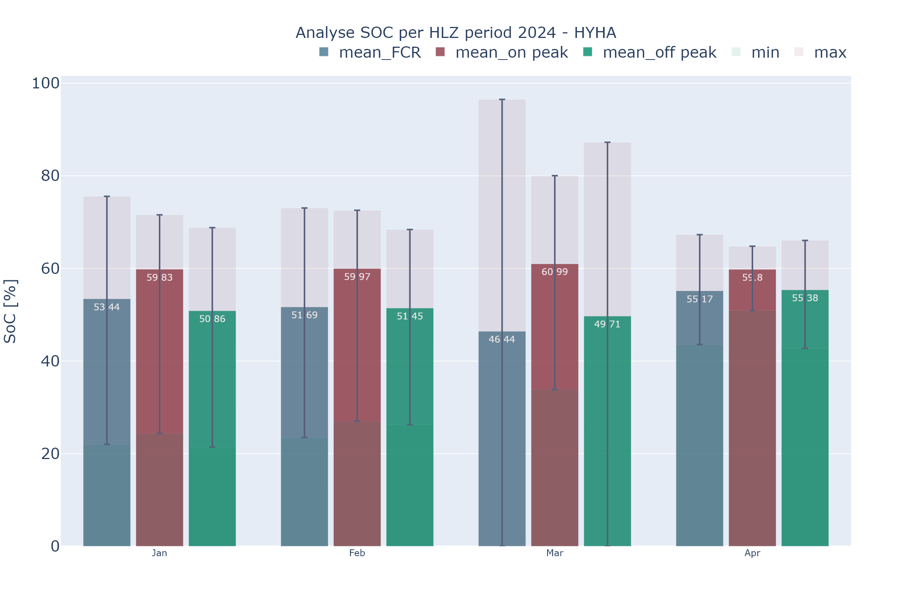

### energy_warranty_plot(self)
 
Module for plot the compared value of cumulative energy and warranty cumulative energy.<br>

**Parameter:**

- `self` (self): General information

**Return:**

- `fig_energy_warranty_poc_month` (go.Figure): Figure contain graph of the energy at POC + cumulative energy compared to warranty energy

**Example:**

```python
plot_KPI(database, 'HYHA', '2024').energy_warranty_plot().show()
# return :
```
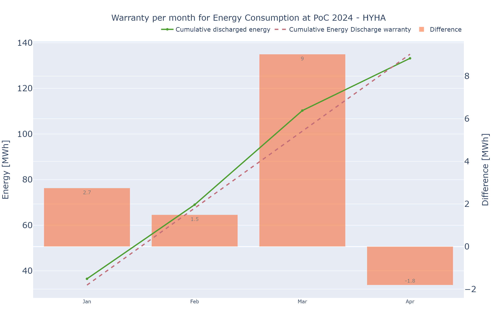

### energy_poc_plot(self)
 
Module for plot the graph of energy at POC for a certain project in a certain period.<br>

**Parameter:**

- `self` (self): General information

**Return:**

- `fig_energy_poc_month` (go.Figure): Figure contain graph of the energy at POC + cumulative energy compared to warranty energy

**Example:**

```python
plot_KPI(database, 'HYHA', '2024').energy_poc_plot().show()
# return :
```
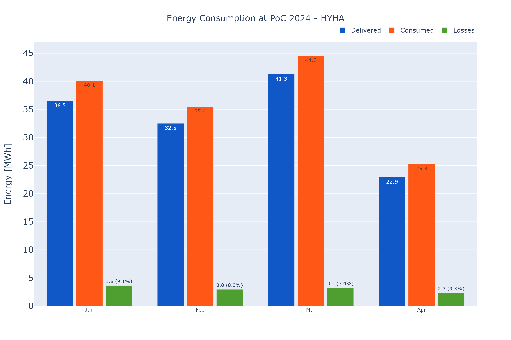


### energy_sorted_plot(self)
 
Module for plot the graph of energy at POC sorted by period for a certain project in a certain period.

**Parameter:**

- `self` (self): General information

**Return:**

- `fig_energy_poc_month_sorted` (go.Figure): Figure contain graph of the energy at POC for each period

**Example:**

```python
plot_KPI(database, 'HYHA', '2024').energy_sorted_plot().show()
# return :
```
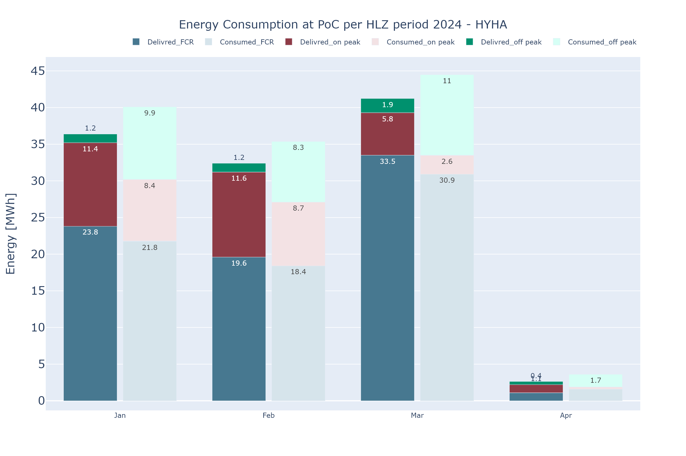

### number_cycle_plot(self)
 
Module for plot the graph of number of cycle for a certain project in a certain period. <br>
Cycle Compute with EOL value like : = Energy discharged in a month/EOL.

**Parameter:**

- `self` (self): General information

**Return:**

- `fig_number_cycle` (go.Figure): Figure contain graph of the number of cycle per period

**Example:**

```python
plot_KPI(database, 'HYHA', '2024').number_cycle_plot().show()
# return :
```
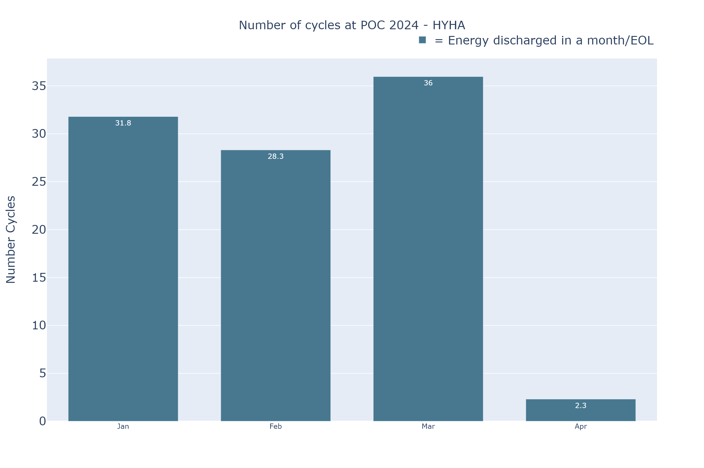

### availability_plot(self)
 
Module for plot the graph of percentage of availability for a certain project in a certain period.

**Parameter:**

- `self` (self): General information

**Return:**

- `fig_availability` (go.Figure): Figure contain graph of the percentage of availability

**Example:**

```python
plot_KPI(database, 'HYHA', '2024').availability_plot().show()
# return :
```
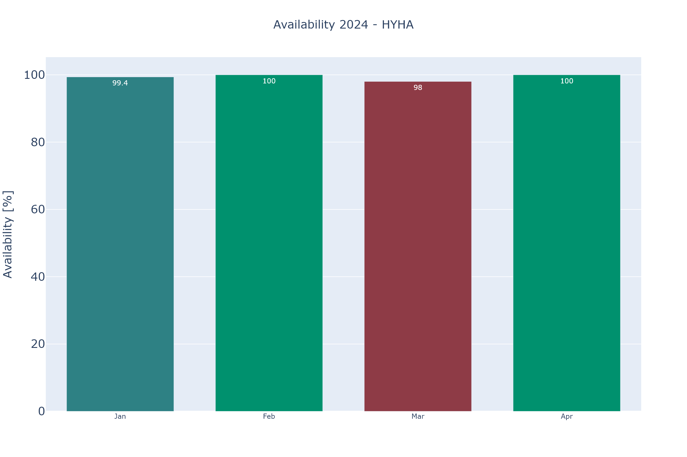

### summary_KPI_past_year_table(self)
 
Module for plot the table of summarized KPI from the previous years for a certain project. <br>
Data used are stored in excel parameters of the specific project, don't touch here to change it.

**Parameter:**

- `self` (self): General information

**Return:**

- `fig_summary` (go.Figure): Figure contain table of the KPI summarized

**Example:**

```python
plot_KPI(database, 'HYHA', '2024').summary_KPI_past_year_table().show()
# return :
```
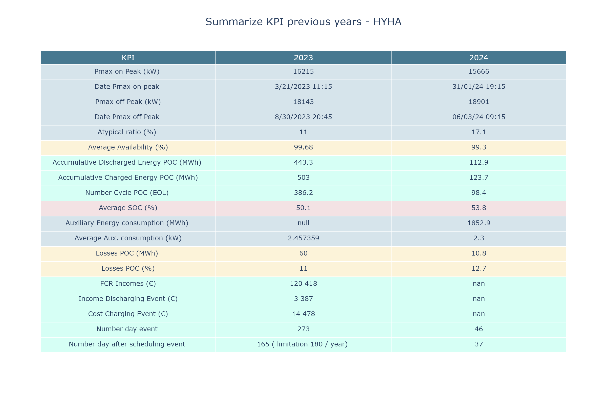

### overview_table(self)
 
Module for plot the table of Overview KPIs and warranty for a certain project.<br>
Data used are stored in excel parameters of the specific project, don't touch here to change it.


**Parameter:**

- `self` (self): General information

**Return:**

- `fig_overview` (go.Figure): Figure contain table of the overviewed KPIs

**Example:**

```python
plot_KPI(database, 'HYHA', '2024').overview_table().show()
# return :
```
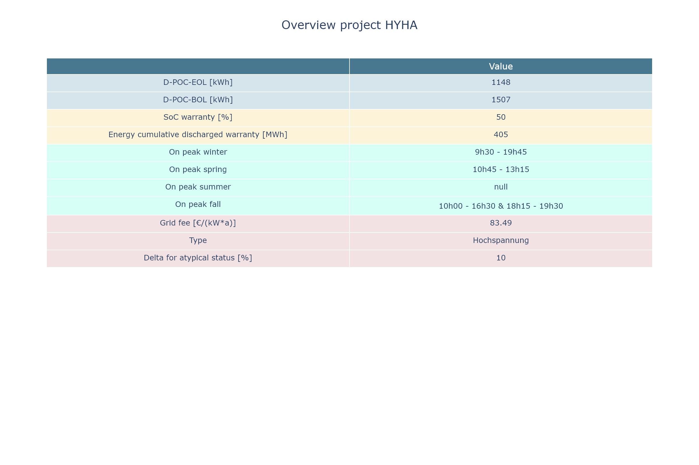

### load_max_plot(self)
 
Module for plot the table of Pmax on/off peak for a certain project. <br>
Useful to know if project atipycal or not.

**Parameter:**

- `self` (self): General information

**Return:**

- `fig_load_max` (go.Figure): Figure contain table of the Pmax on/off peak + atipycal values

**Example:**

```python
plot_KPI(database, 'HYHA', '2024').load_max_plot().show()
# return :
```
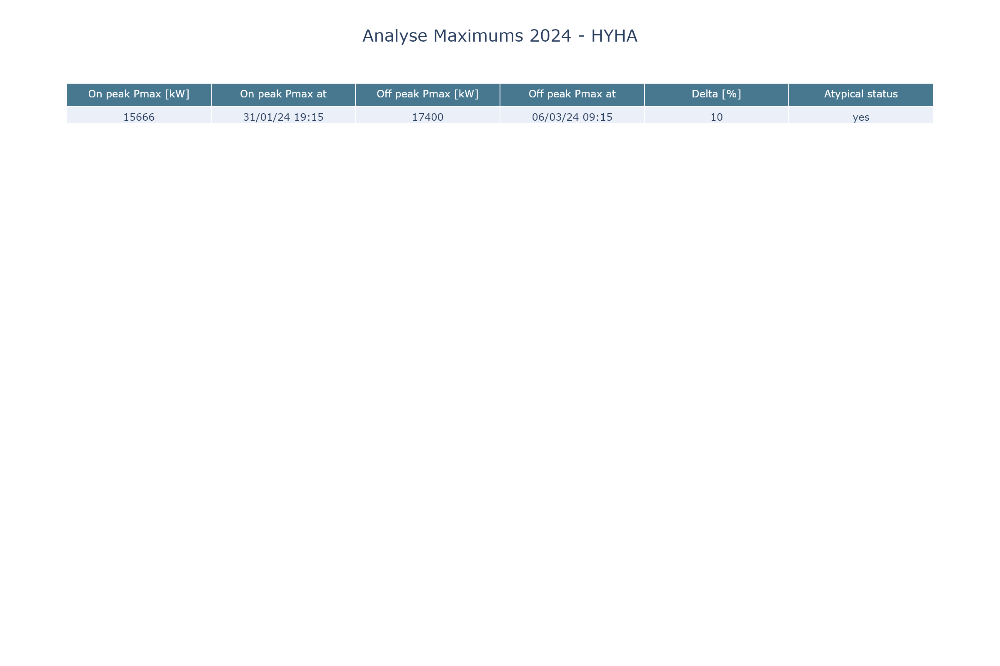

### event_day(self)
**FCR method**<br>
Module for plot the event days and event days after schedule for a certain project.<br> 
Useful to know how many day after schedule we do. Warranty to respect.

**Parameter:**

- `self` (self): General information

**Return:**

- `fig_event_day` (go.Figure): Figure contain plot of event day per month

**Example:**

```python
plot_KPI(database, 'HYHA', '2024').event_day().show()
# return :
```
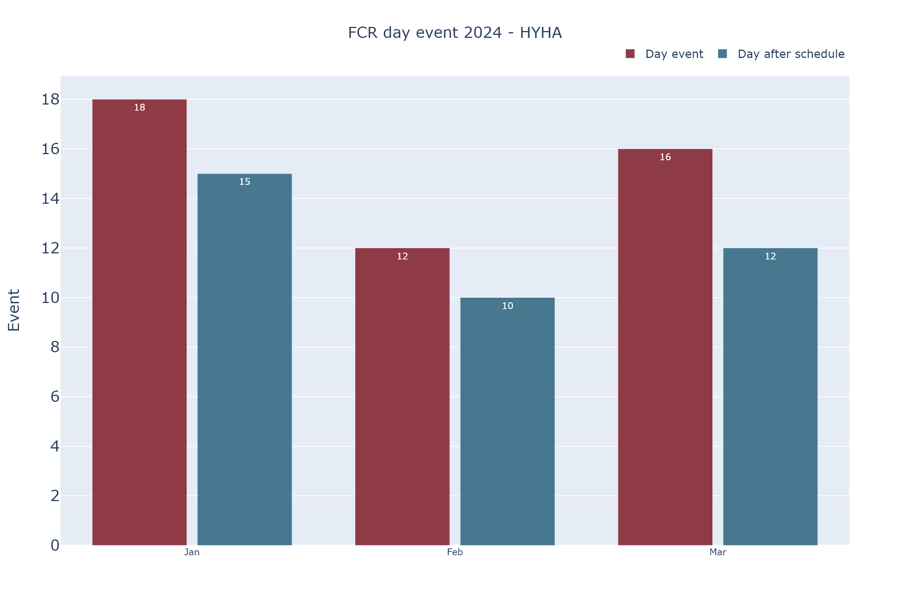

### event_count(self)
**FCR method**<br>
Module for plot the number of event charge and discharge for a certain project.

**Parameter:**

- `self` (self): General information

**Return:**

- `fig_event` (go.Figure): Figure contain plot of number event charge/discharge per month

**Example:**

```python
plot_KPI(database, 'HYHA', '2024').event_count().show()
# return :
```
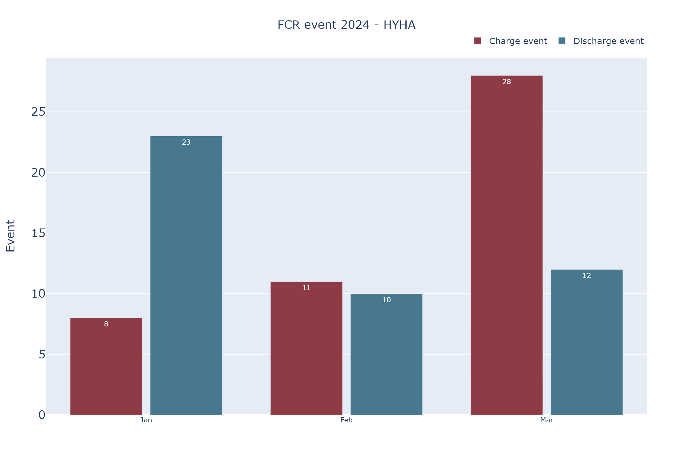

### event_energy(self)
**FCR method**<br>
Module for plot the energy from a charge or discharge event for a certain project.

**Parameter:**

- `self` (self): General information

**Return:**

- `fig_ener_event` (go.Figure): Figure contain plot of energy charge and discharge event per month in MWh

**Example:**

```python
plot_KPI(database, 'HYHA', '2024').event_energy().show()
# return :
```
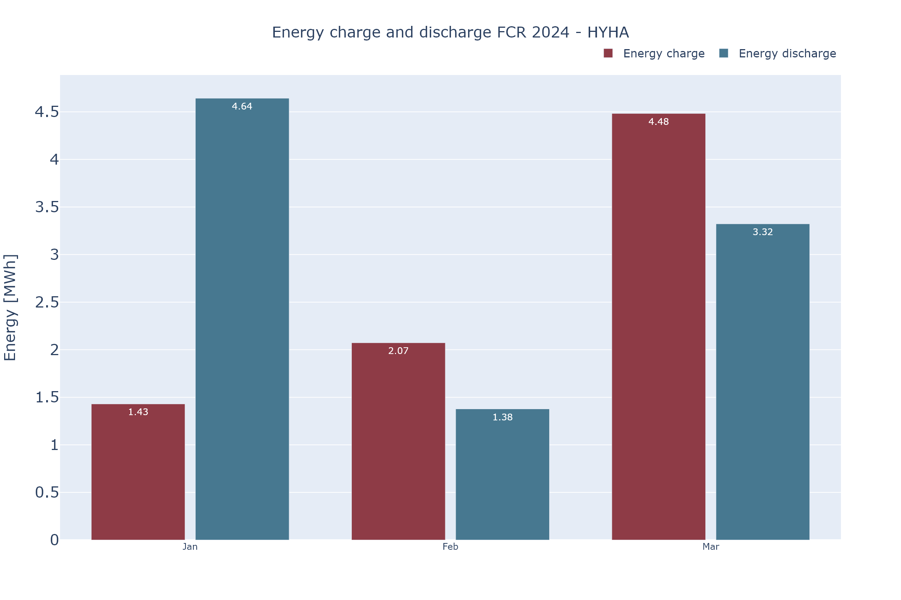

### period_time_pie_chart(self)

Module for plot the pie chart of hours for periods in the selected month.

**Parameter:**

- `self` (self): General information

**Return:**

- `fig_period` (go.Figure): Figure pie chart percentage of period for this month

**Example:**

```python
plot_KPI(database, 'HYHA', '2024').period_time_pie_chart().show()
# return :
```
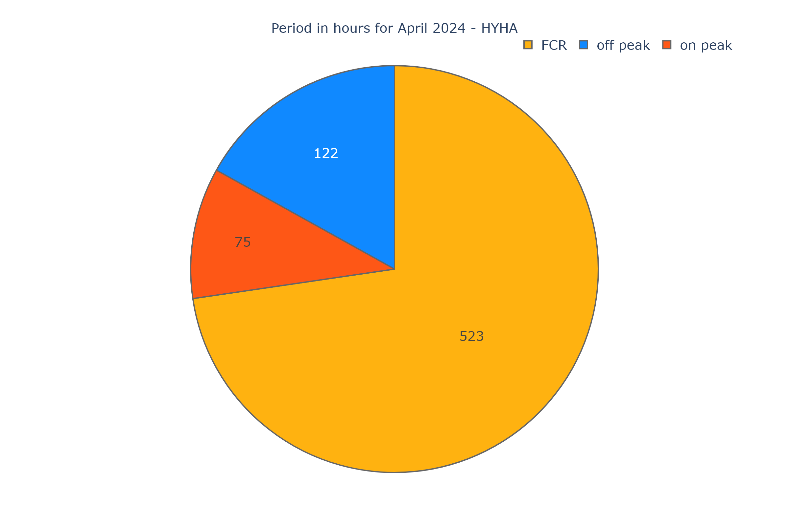

### period_overview_plot(self)

Module for plot overview of hours for periods in the selected year.

**Parameter:**

- `self` (self): General information

**Return:**

- `fig_period_overview` (go.Figure): Figure of the period percentage for this year per month

**Example:**

```python
plot_KPI(database, 'HYHA', '2024').period_overview_plot().show()
# return :
```
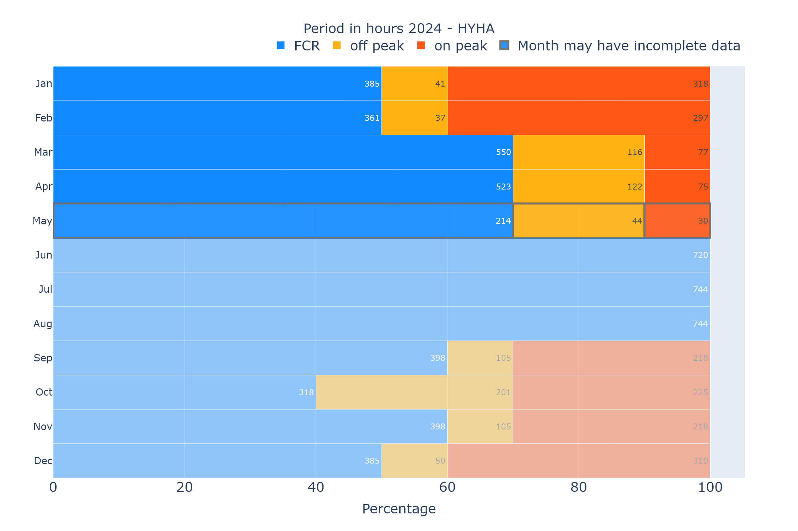
