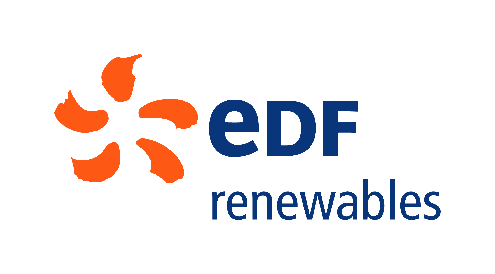

# Monthly Report for BESS KPI
This project is the property of EDF Renewable Storage - Berlin

______________________________________________________________
Welcome in the documentation of the monthly report for BESS KPI code. Let's get a tour ! 
## Requirements
⚠️ Python version 3.11.9 is required for use this code. Please make sure you have the good version [tuto How to update Python on Windows](https://www.geeksforgeeks.org/how-to-update-python-on-windows/). 
## Getting started
If it's the first time you see this code, I recommend you to go directly in the section [Getting started](user_guide/Getting_start.md). You'll find everything you for start correctly this project and use it.  
## Tool development
For those how are not new here and want to modify this code. I'll recomend you to visit the section **Developper guide**. You'll find everything you need for deploy/change/use this code.
By the same time, you'll find lot of information regarding the existing class and method in the **libraries section**.

And most important don't forget to enjoy your croissant 🥐 when all report are created !