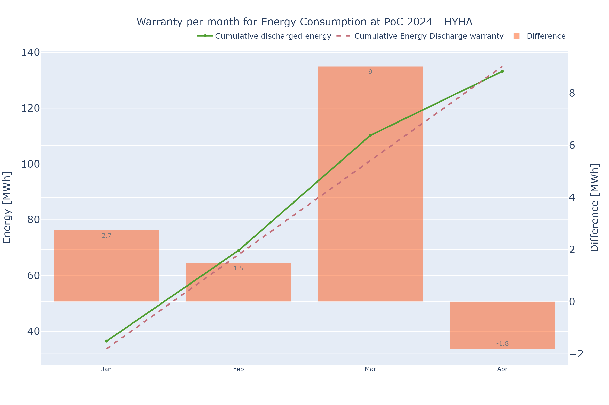
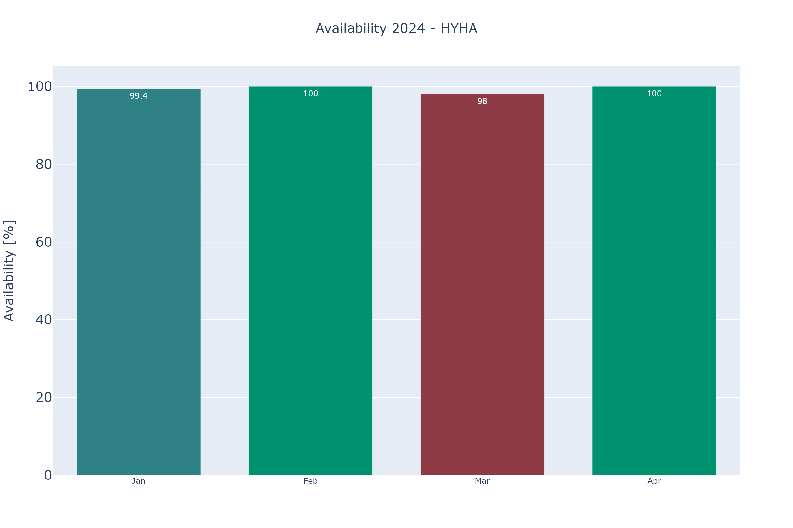
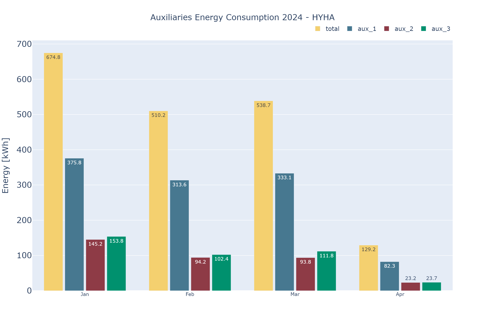
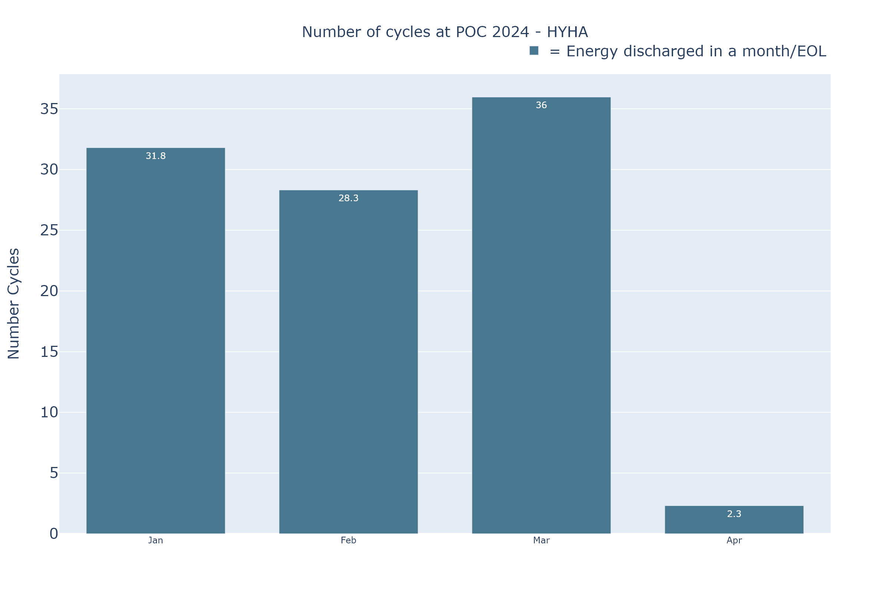

# Export KPI

## Dependencies
|Librairies | version|
|-----------|--------|
|KPI_plot.py (local)| - |
|parameters_project.py (local)| - |
|inspect | - |
|pandas| 2.2.1 |
|pathlib.Path| - |
|plotly.io.pio| 5.20.0 |
|os| - |
|tqdm.tqdm| 4.66.2 |

## Summary
Class used to export and create list of KPI object. Used for export the appendix, and create the "list_fig" which contain main information for KPIs.<br/>
**class_name** : export_data
**method availaible** :
* download_KPIs
* show_KPIs
* show_KPI_filtered
* download_KPI_filtered 

## Class
### \_\_init\_\_(self, database, project, year, month_short) -> None
Initializes an instance of the class.<br/>
**Parameters:**

- `database` (str): The name of the database.

- `project` (str): The name of the project.

- `year` (str): The year for the project.

- ``month_short`` (str): Month short of the current month selected

**Returns:**  

- `nan` (None) :
    No return value

**Example:**  
```python
# Create an instance of the class
database = "example_database"
project = "example_project"
year = "2022"
obj = export_data(database, project, year)

# Access the attributes
print("database:", obj.database)
print("project:", obj.project)
print("year:", obj.year)
print("year_short:", obj.year_short)
```

### get_methods(self)
Intern Module to get all name of methods from KPI_plot.

**Parameter:**

- `self` (self) :
    General information

**Returns:**

- `fig_store` (df) :
    DataFrame with names and categories of KPI

- `plot_method` (array) :
    Array with all methods from KPI_plot module

- `def_plot` (module) :
    Module of plot_KPI in order to get the methods from it

**Example:**  
```python
# Create an instance of the class
obj = export_data(database, project, year, month_short)

# Call the get_methods method
fig_store, plot_method, def_plot = obj.get_methods()

# Print the results
print("fig_store:", fig_store)
print("plot_method:", plot_method)
print("def_plot:", def_plot)
```

### export_appendix(self, path_export):
Module to export data and format it.

**Parameters:**

- ``self`` (self): General information 

- ``path_export`` (str): Path where to export the excel file. 

**Returns:**
- `nan` (None) :
    No return value

**Example:**  
```python
# Create an instance of the class
obj = export_data(database, project, year, month_short)

# Call the method
obj.export_appendix('./appendix/')
>> KPI appendix will be export.
>> Your KPI appendix is exported, you can found the file here : ./appendix/
```

### get_list_fig(self)
Create the list_fig which will create a dataframe with names, categories and [KPI object](./kpi_py/kpi_fig-class.md). <br>
Long computation warning, need to cache if possible. 

**Parameters:**

- `self` (self) :
    General information


**Returns:**

- `list_fig` (pd.Dataframe): dataframe with columns ['name','category','object']
    * list_fig['name'] (str): Name of the KPI
    * list_fig['category'] (str): Name of the category of the KPI
    * list_fig['object'] (KPI.KPI_fig object): Object of the KPI (more details [here](./kpi_py/kpi_fig-class.md)) 

**Example:**

```python
# Create an instance of the class
obj = export_data(database, project, year, month_short)

# Call the export_KPI method
fig_list = obj.get_list_fig()
```
## Method
### download_KPIs(fig_list, path:str, type='png', width=1200, height=800, scale=2)
Method for download all the figure from the given fig_list. 

**Parameter:**

* ``fig_list`` (df): List of figures to add in the KPI. Need to have column ['name', 'category', 'object']. Get this list from export_data.get_list_fig.

* ``path`` (str): Path where to store the png plot

* ``type`` (str): Type of file selected (Default : png)
    * png
    * svg
    * jpg
    * webp
    * pdf
    * eps

* ``height`` (int): Height of the image (Default : 800)

* ``width`` (int): Width of the image (Default : 1200)

* ``scale`` (int): Scale of the image (Default : 2)

**Returns:**

- `nan` (None) :
    No return value

**Example:**  
```python
import export_KPI
# Call the method
export_KPI.download_KPIs(fig_list, './plot_img/')
>> KPI plot will be exported.
>> [88888888______] progress bar
>> Your KPI plot are exported, you can found them here : './plot_img/
```

###  download_KPI_filtered(fig_list, category_to_download, path:str, type='png', width=1200, height=800, scale=2)
Method for download the figure from a particular categorie from the given fig_list. 

**Parameter:**

* ``fig_list`` (df): List of figures to add in the KPI. Need to have column ['name', 'category', 'object']. Get this list from export_data.get_list_fig.

* ``category_to_download`` (str): Name of the category to plot

* ``path`` (str): Path where to store the png plot

* ``type`` (str): Type of file selected (Default : png)
    * png
    * svg
    * jpg
    * webp
    * pdf
    * eps

* ``height`` (int): Height of the image (Default : 800)

* ``width`` (int): Width of the image (Default : 1200)

* ``scale`` (int): Scale of the image (Default : 2)

**Returns:**

- `nan` (None) :
    No return value

**Example:**  
```python
import export_KPI
# Call the method
export_KPI.download_KPI_filtered(fig_list,'1_Overview', './plot_img/')
>> KPI plot will be exported.
>> [88888888______] progress bar
>> Your KPI plot are exported, you can found them here : './plot_img/
```

###  show_KPIs(fig_list)
Method for show all the figure from the given fig_list. 

**Parameter:**

* ``fig_list`` (df): List of figures to add in the KPI. Need to have column ['name', 'category', 'object']. Get this list from export_data.get_list_fig.

**Returns:**

- `nan` (None) :
    No return value

**Example:**  
```python
import export_KPI
# Call the method
export_KPI.show_KPIs(fig_list)
```
|||
|---|---|
|||
|||
|...|...|

###  show_KPI_filtered(fig_list, category_to_plot)
Method for show all the figure of a specific category from the given fig_list. 

**Parameter:**

* ``fig_list`` (df): List of figures to add in the KPI. Need to have column ['name', 'category', 'object']. Get this list from export_data.get_list_fig.

* ``category_to_plot`` (str): Name of the category to plot

**Returns:**

- `nan` (None) :
    No return value

**Example:**  
```python
import export_KPI
# Call the method
export_KPI.show_KPI_filtered(fig_list, '2_warranties')
```
|||
|---|---|
|||
||...|