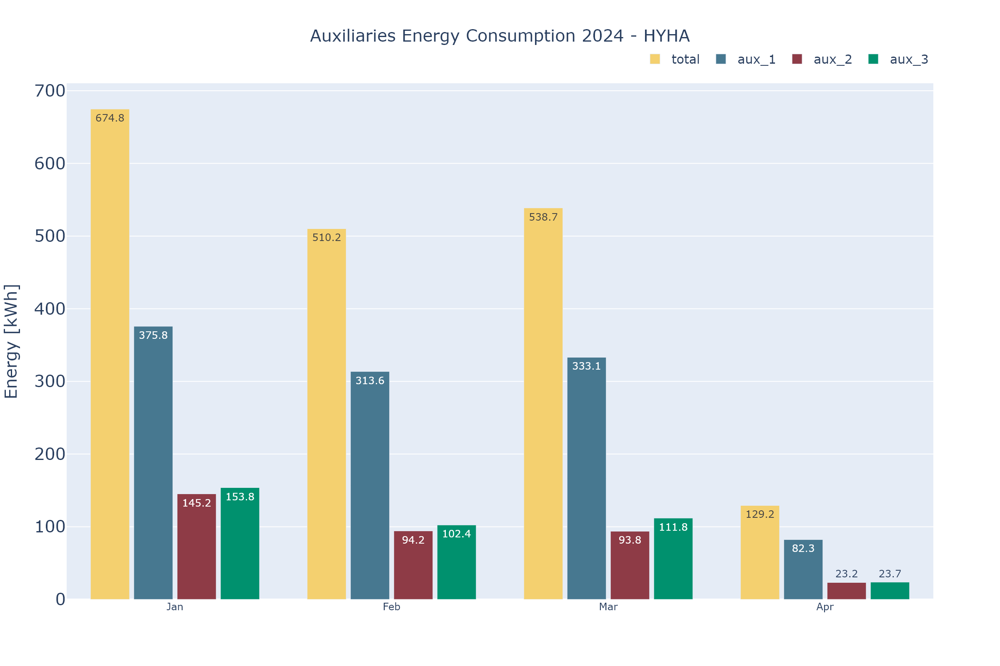

# KPI\_fig class

## **init** (self, name:str, category:str, rank:int, method:str, figure, change\_on\_month=False):

Initialize the class.

**Parameters:**

* `self` (self): General information
* `name`(str): Name of the KPI.
* `category`(str): Category of the KPI.
* `rank`(int): Rank associated to the position in the pdf of the KPI.
* `method` (str): Name of the method use for plot this KPI.
* `figure`(plotly.graph-object.Figure): Store figure of the KPI.
* `change_on_month`(bool): If the KPI need to be update if the month selected change.

**Returns:**

* `Object` (Object): Object of KPI 

**Example:**

```py
from KPI import KPI_fig
# Create an instance of the class
figure_of_my_KPI = KPI_fig('name', 'Overview', 1, 'method_name', figure, True)
```

 ## show_KPI(self):

Use for show the KPI plot

**Parameters:**

* `None` (None): No return value.

**Returns:**

* Figure display

**Example:**
```py
from KPI import KPI_fig
# Create an instance of the class
KPI = KPI_fig('aux_energy', '3_op_sumup', 1, 'aux_energy', figure("aux_energy"), False)
# Show the KPI figure
KPI.show_KPI()
```


## get_category(self):

Get the category of this KPI. 

**Parameters:**

* `None` (None): No return value.

**Returns:**

* ``cat`` (str): Category of the KPI 

**Example:**
```py
from KPI import KPI_fig
# Create an instance of the class
KPI = KPI_fig('name', 'Overview', 1, 'method_name', figure, True)
# Show the KPI figure
KPI.get_category()
>> 'Overview'
```

## get_fig(self):

Get the figure of the KPI. 

**Parameters:**

* `None` (None): No return value.

**Returns:**

* ``fig`` (go.Figure()): Return the figure of the KPI 

**Example:**
```py
from KPI import KPI_fig
# Create an instance of the class
KPI = KPI_fig('name', 'Overview', 1, 'method_name', figure, True)
# Show the KPI figure
KPI.get_fig()
>> go.Figure(figure)
```

## get_name(self):

Get the name of the KPI. 

**Parameters:**

* `None` (None): No return value.

**Returns:**

* ``name`` (str): Return the name of the KPI 

**Example:**
```py
from KPI import KPI_fig
# Create an instance of the class
KPI = KPI_fig('name', 'Overview', 1, 'method_name', figure, True)
# Show the KPI figure
KPI.get_name()
>> 'name'
```

## get_rank(self):

Get the rank of the KPI. 

**Parameters:**

* `None` (None): No return value.

**Returns:**

* ``rank`` `(int): Return the rank of the KPI 

**Example:**
```py
from KPI import KPI_fig
# Create an instance of the class
KPI = KPI_fig('name', 'Overview', 1, 'method_name', figure, True)
# Show the KPI figure
KPI.get_rank()
>> '1'
```

## get_png(self):

Get the path to the png of the KPI. 

**Parameters:**

* `None` (None): No return value.

**Returns:**

* ``path`` (str): Return the path to the png of the KPI 

**Example:**
```py
from KPI import KPI_fig
# Create an instance of the class
KPI = KPI_fig('name', 'Overview', 1, 'method_name', figure, True)
# Show the KPI figure
KPI.get_png()
>> '../img/HYHA/name.png'
```

## get_change_on_month(self):

If the KPI need to be upload if month selected change.    

**Parameters:**

* `None` (None): No return value.

**Returns:**

* ``change_on_month`` (bool): Return True if yes, otherwise False (Default False)

**Example:**
```py
from KPI import KPI_fig
# Create an instance of the class
KPI = KPI_fig('name', 'Overview', 1, 'method_name', figure, True)
# Show the KPI figure
KPI.get_change_on_month()
>> 'True'
```

## get_method(self):

Get the method to update the figure  

**Parameters:**

* `None` (None): No return value.

**Returns:**

* ``method`` (str): Name of the method link in plot_KPI class

**Example:**
```py
from KPI import KPI_fig
# Create an instance of the class
KPI = KPI_fig('name', 'Overview', 1, 'method_name', figure, True)
# Show the KPI figure
KPI.get_method()
>> 'method_name'
```

## upload_fig(self, fig):

Upload change on the figure of the KPI. 

**Parameters:**

* ``fig`` (go.Figure()): New figure to upload

**Returns:**

* `None` (None): No return value.

**Example:**
```py
from KPI import KPI_fig
# Create an instance of the class
KPI = KPI_fig('name', 'Overview', 1, 'method_name', figure, True)
# Show the KPI figure
KPI.upload_fig(new_fig)
```

## download(self, path:str, type="png", height=800, width=1200, scale=2):

Download in a type the figure of the KPI. Save the path in self.path_to_img

**Parameters:**

* ``path`` (str): Path where to store the png plot

* ``type`` (str): Type of file selected (Default : png)
    * png
    * svg
    * jpg
    * webp
    * pdf
    * eps

* ``height`` (int): Height of the image (Default : 800)

* ``width`` (int): Width of the image (Default : 1200)

* ``scale`` (int): Scale of the image (Default : 2)

**Returns:**

* ``Finish`` (Bool): True if the image is exported

**Example:**
```py
from KPI import KPI_fig
# Create an instance of the class
KPI = KPI_fig('name', 'Overview', 1, 'method_name', figure, True)
# Show the KPI figure
KPI.download('./img/', 'jpg', 1200, 1600, 1)
>> 'True'
```