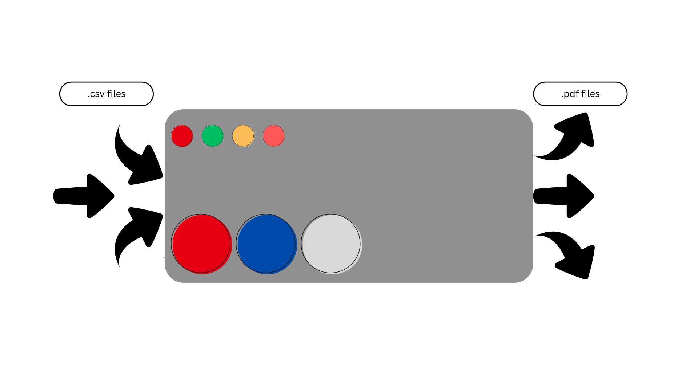
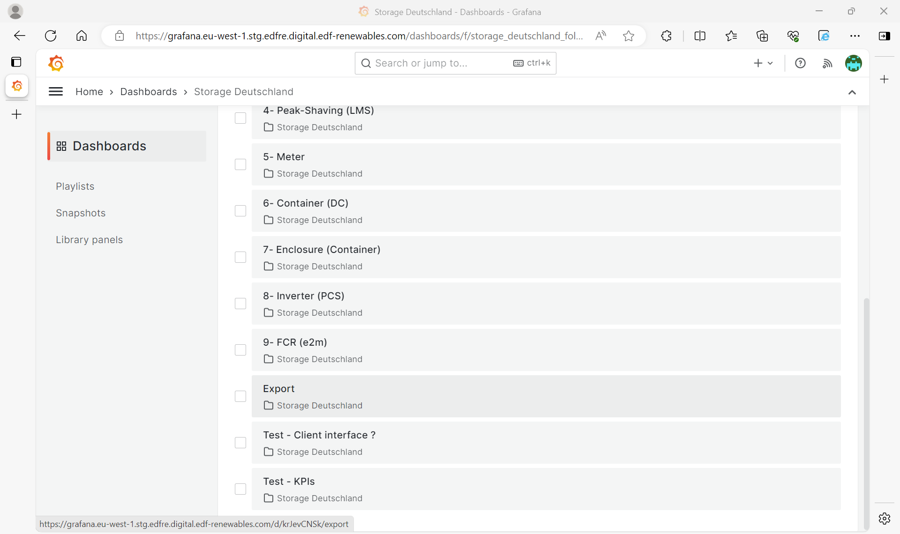
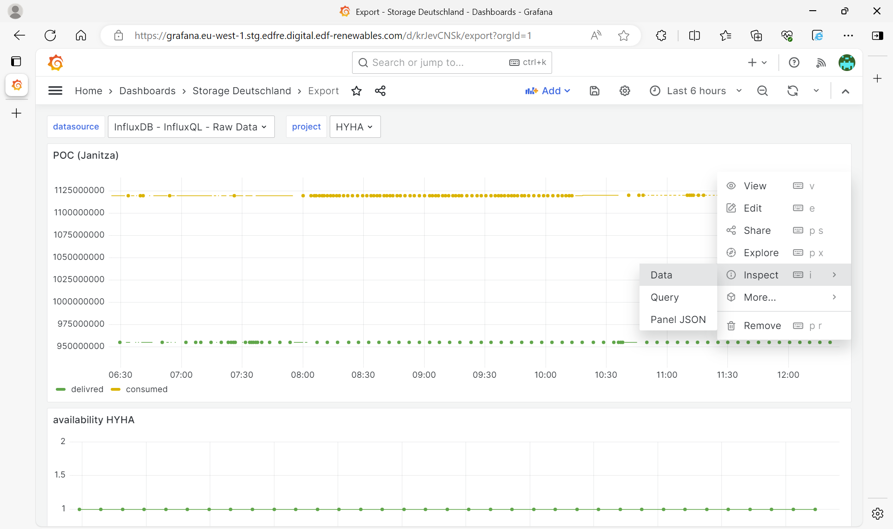
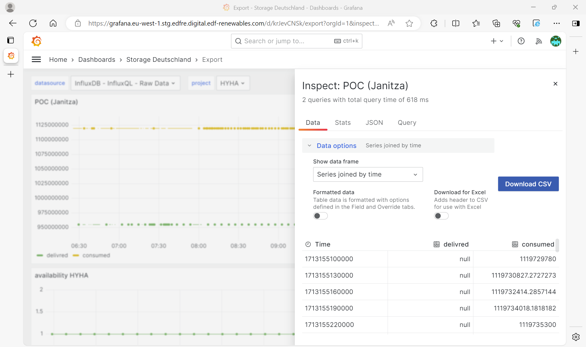

# Data How it's work ? 

You can see this system like a box with input, output and some buttons.

<center>*Representation of this code like a box*</center><br><br>
You can have many ressources as long as the file of input is in csv format and have a time in this file. <br>
The code can support project from Grafana : BREM, HYHA, WERN

## Required tag
Those tags are needed to get the KPI monthly report (Normaly if you download all the panel from Grafana/Export you have all the tags available). <br>

'Time', 'aux 1', 'aux 2', 'aux 3', 'availability', '15 min data',
'permissible power', '[L]', '[AP2]', 'BESS power',
'15mn average power', '15s average power', 'P', 'SOC',
'LMS request discharge', 'delivred', 'consumed'

## Tutorial for getting data from Grafana
1) Go one the website and open the export dashboard. 

2) Select the project you want and the time range.<br> 
3) For each panel. Go on the 3 dot (left top of the panel). Select Inspect>Data.

4) Now select in the Show data frame : Series joined by time. Untick Formatted data (otherwise the time format in not support by this code) and click on the button "Download CSV". 

5) Final step is to save this files in the good place. Copy the download files in ``Data>Data_project>{name of the project}>{year of this data}``.<br>
I continue with the example, we have download data from the HYHA project in 2024, so I'll saved the data in ```Data>Data_project>HYHA>2024```<br>
6) You are able to use the data from Grafana in the report !