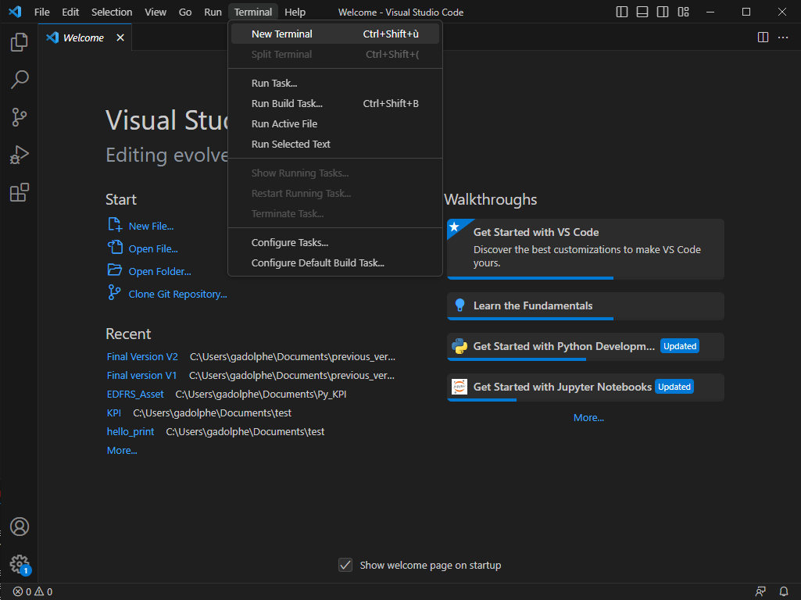
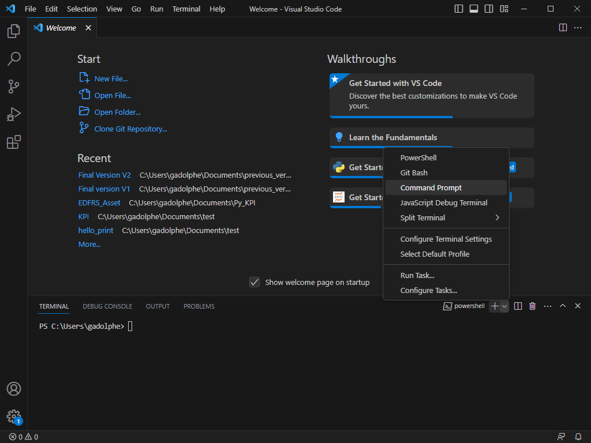

# Install environment

It's the first time you download this project ? Welcome ! I'll show you how it's work.\
For have nice KPI report you will need some libraries, don't worries it's easy 😉\


## Install libraries

Everything for installing libraries will be done in the terminal

### Enter in the Terminal (command prompt) \[Windows]

1. Search for the application **Command Prompt** in your search tab in windows.\

2. Move until the folder project (use the command line `cd` to navigate in the path).

### Enter in the Terminal (command prompt) \[VS code]

1.  Open the terminal tab in VS Code :\
    

2.  Open a new command prompt terminal in the terminal tab by select the arrow near the +, and select command prompt:\
    

### Install Virtual environment

1. Run the script below within the directory to create your own virtual environment :

```
python -m venv name_of_Venv
```

2. Activate your Venv, run next line :

```
cd name_of_Venv/Scripts
activate
```

\
3\) Use \`\`\`cd ..\`\`\` twice to come back at the main path of the project.\


### Install requirements.txt

1.  When it's done, go in your Librairies folder :

    ```
    cd Librairies
    ```

2.  Now you can install all the needed libraries in your virtual environment. You just need to run this line of code (It will install all the libraries in the requirements.txt file) (You may have to remove the Kaleido library line, we'll install it later):

    ```
    pip install -r requirements.txt --trusted-host pypi.org --trusted-host files.pythonhosted.org
    ```
    
3.  Install Kaleido library also, by using this line of command :

    ```
    pip install --trusted-host pypi.org --trusted-host files.pythonhosted.org -U kaleido-0.1.0.post1-py2.py3-none-win_amd64.whl
    ```

### Select the environment for you jupyter notebooks

1. Before running any code, you will need to select the kernel of your virtual environment. Normally just run the first cell and it will propose you the kernel with the name of your virtual environment. If not, you can follow this tuto to do manually : [Setting up VS code to use the virtual environment in a jupyter notebook](https://python.plainenglish.io/how-to-work-with-python-virtual-environments-jupyter-notebooks-and-vs-code-536fac3d93a1)\

2. To be sure that the installation goes well, you can run the both jupyter notebook in the example folder. You can now enjoy to do monthly report !

### Add to gitignore

.gitignore is useful if you do some developing stuff on this code. To insure that you will not put online your virtual environment (too much data for github), we'll add your virtual environment in the gitignore (git push will ignore the files / folders on this file).\


1. Open the file .gitignore.\

2. Write the name\_of\_venv created earlier.\

3. Save the file.\


