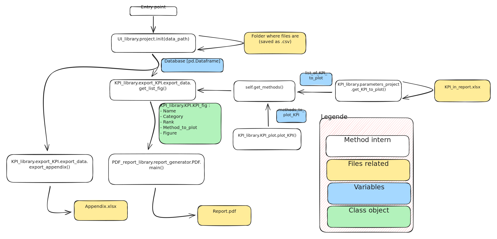

# Architecture

You will find many folders in this project. I'll explain wich are important for you.

* **.gitBook**

Where the md file for this documentation are stored.&#x20;

* **.vsCode**

Configuration files for Vs Code

* **00\_Report\_Generator**

The main folders. You will find one notebook that will allow to generate the monthly report of a project very easily.\
Just follow what it say in this notebook.

* **01\_Examples**

&#x20;The second folders that is useful for you. It list all the specific tool from this code and give a example code to how to use it.

* **Data**

Folder where data of a project is stored. Please refer to [Data](Data.md) for an explaination of this folder.

* **output**

\[maybe not created yet] Folder where all the output of the code useful for you. You'll find the image of KPI, the report, the appendix. Please, the code manage alone this folder, don't try to modify something inside.

* **om\_tools**

Librairies with all functionnalities explained in [Librairies](../librairies/).&#x20;

* **Others**

Legacy of others project before, keeped as an archive.&#x20;

* **test**

Unlike those folders above, if the feeling of code/test something got you, you can go in this folder and release your creativity ! While you stay in this folder you'll broke nothing. You can found help for libraries on this documentation.

## How methods are linked&#x20;

